# Human Resource Analytics
Sourav Ghosh  
August 25, 2017  


Load the required libraries

```r
library(reshape)
library(ggplot2)
library(e1071)
library(ROCR)
```

```
## Loading required package: gplots
```

```
## 
## Attaching package: 'gplots'
```

```
## The following object is masked from 'package:stats':
## 
##     lowess
```

```r
library(randomForest)
```

```
## randomForest 4.6-12
```

```
## Type rfNews() to see new features/changes/bug fixes.
```

```
## 
## Attaching package: 'randomForest'
```

```
## The following object is masked from 'package:ggplot2':
## 
##     margin
```

```r
library(caret)
```

```
## Loading required package: lattice
```

```r
library(corrplot)
library(dplyr) 
```

```
## 
## Attaching package: 'dplyr'
```

```
## The following object is masked from 'package:randomForest':
## 
##     combine
```

```
## The following object is masked from 'package:reshape':
## 
##     rename
```

```
## The following objects are masked from 'package:stats':
## 
##     filter, lag
```

```
## The following objects are masked from 'package:base':
## 
##     intersect, setdiff, setequal, union
```

```r
library(rattle)
```

```
## Rattle: A free graphical interface for data mining with R.
## Version 4.1.0 Copyright (c) 2006-2015 Togaware Pty Ltd.
## Type 'rattle()' to shake, rattle, and roll your data.
```

```r
library(rpart)
```

Load the file and remove the duplicated rows

```r
df <- read.csv("C:\\Users\\SGHOSH13\\Documents\\GyanData\\HR Analytics\\People Charm case_1.csv", stringsAsFactors = F)

dups <- which(duplicated(df))

df <- df[-dups, ]

copydf <- df
```

First lets start with some exploratory data analysis.


```r
df$leftStatus[df$left ==  1] = 'Left'
df$leftStatus[df$left ==  0] = 'Stayed'

#Create a barplot of Employee Quit Status by Department 
analysisTable <- table(df$leftStatus, df$dept)
analysisTable
```

```
##         
##          accounting   hr   IT management marketing product_mng RandD sales
##   Left           85   88  131         47        90          86    69   450
##   Stayed        353  317  556        303       386         422   420  1933
##         
##          support technical
##   Left       250       313
##   Stayed    1005      1237
```

```r
barplot(analysisTable, main="Employees left vs Department",
        xlab="Department", col=c("red","green"))

axis(2, at = 0:5, labels = 0:5)
legend("topleft", rownames(analysisTable), fill = c("red","green"), bty = 'n', cex = 0.9)
```

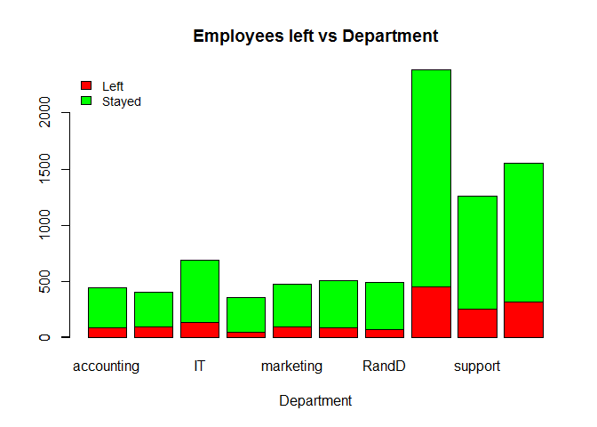<!-- -->

Visualise the Correlation amongst variables


```r
department <- unique(df$dept)
df$dept <- as.numeric(1:10)[match(df$dept, department)] 
df$salary <- as.numeric(1:3)[match(df$salary, c('low', 'medium', 'high'))]

corr <- cor(df[, c(1:10)])
corr <- melt(corr)
ggplot(corr, aes(X1, X2, fill = value)) + geom_tile() + 
  scale_fill_gradient(low = "yellow",  high = "red") + 
  geom_text(aes(label = round(value, 1))) +
  theme(axis.text.x=element_text(angle=90,hjust=1,vjust=0.5))
```

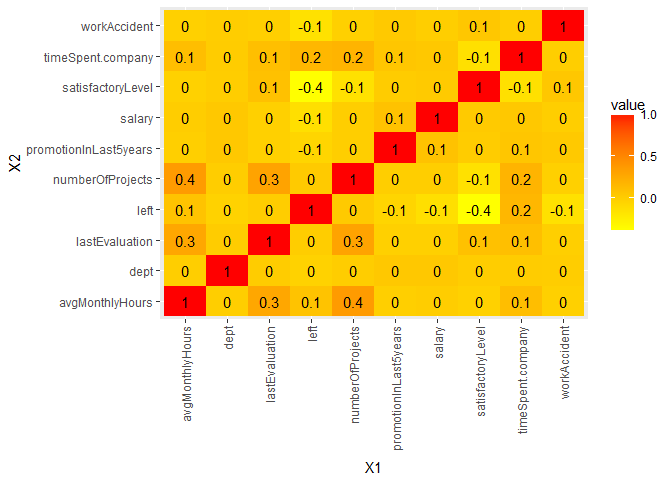<!-- -->

Some more analysis to analyse who are the people who have quit


```r
df <- copydf

quantile(as.numeric(df$avgMonthlyHours), probs = c(0,1/3,2/3,1))
```

```
##        0% 33.33333% 66.66667%      100% 
##        96       170       230       310
```

```r
df$hrs <- cut(df$avgMonthlyHours, c(96, 170, 230, 310), include.lowest=TRUE)

p1 = ggplot(data = df, aes(satisfactoryLevel, lastEvaluation))
p1 + geom_point(aes(color = factor(left))) + ggtitle("Satisfaction Level vs Evaluation Score\nvs Left") +
  theme(plot.title=element_text(size = 20, face = "bold", hjust = 0.5)) +
  theme(legend.title=element_text(size=8)) + theme(legend.text=element_text(size=10))+
  guides(colour = guide_legend(override.aes = list(size=9))) +
  theme(legend.text = element_text(size=15, face="bold"))
```

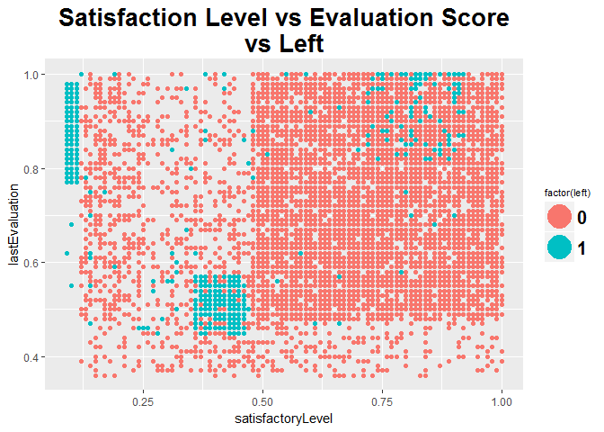<!-- -->

```r
p2 = ggplot(data = df, aes(satisfactoryLevel, lastEvaluation))
p2 + geom_point(aes(color = factor(timeSpent.company))) + ggtitle("Satisfaction Level vs Evaluation Score\nvs Years Worked") +
  theme(plot.title=element_text(size = 20, face = "bold", hjust = 0.5)) +
  theme(legend.title=element_text(size=8)) + theme(legend.text=element_text(size=10))+
  guides(colour = guide_legend(override.aes = list(size=9))) +
  theme(legend.text = element_text(size=15, face="bold"))
```

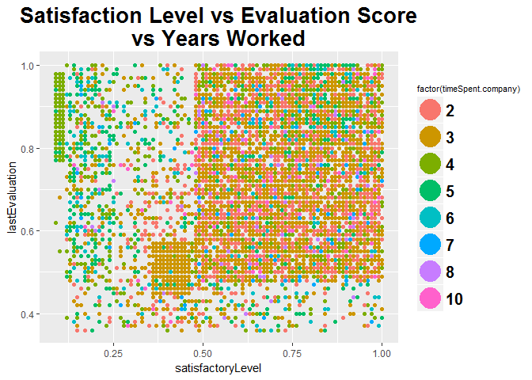<!-- -->

```r
p4 = ggplot(data = df, aes(satisfactoryLevel, lastEvaluation))
p4 + geom_point(aes(color = factor(df$numberOfProjects))) + ggtitle("Satisfaction Level vs Evaluation Score\nvs No. of Projects") +
    theme(plot.title=element_text(size = 20, face = "bold", hjust = 0.5)) +
    theme(legend.title=element_text(size=8)) + theme(legend.text=element_text(size=10))+
    guides(colour = guide_legend(override.aes = list(size=9))) +
    theme(legend.text = element_text(size=15, face="bold"))
```

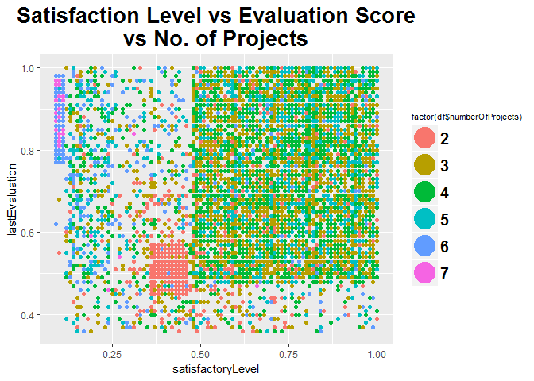<!-- -->

```r
p3 = ggplot(data = df, aes(salary, dept))
p3 + geom_jitter(aes(color = factor(left))) + ggtitle("Quits by Salary Grade by Department") +
  theme(plot.title=element_text(size = 20, face = "bold", hjust = 0.5)) +
  theme(legend.title=element_text(size=8)) + theme(legend.text=element_text(size=10))+
  guides(colour = guide_legend(override.aes = list(size=9))) +
  theme(legend.text = element_text(size=15, face="bold")) + 
  scale_color_manual(values=c("red", "black"))
```

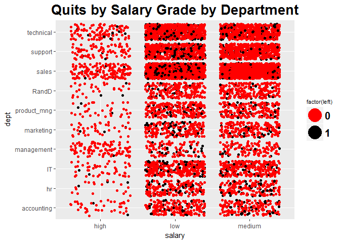<!-- -->

```r
p4 = ggplot(data = df, aes(satisfactoryLevel, lastEvaluation))
p4 + geom_point(aes(color = factor(salary))) + ggtitle("Satisfaction Level vs Evaluation Score\nvs Salary Grade") +
  theme(plot.title=element_text(size = 20, face = "bold", hjust = 0.5)) +
  theme(legend.title=element_text(size=8)) + theme(legend.text=element_text(size=10))+
  guides(colour = guide_legend(override.aes = list(size=9))) +
  theme(legend.text = element_text(size=15, face="bold"))
```

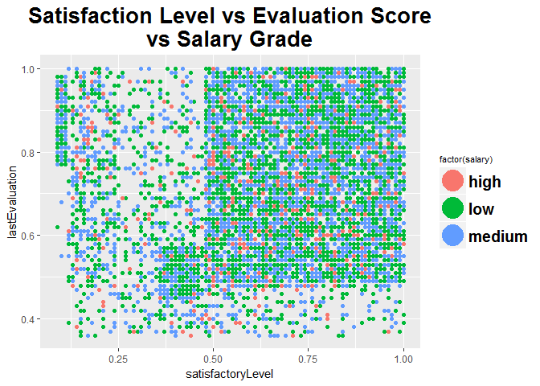<!-- -->

```r
p5 = ggplot(data = df, aes(satisfactoryLevel, lastEvaluation))
p5 + geom_point(aes(color = factor(hrs))) + ggtitle("Satisfaction Level vs Evaluation Score\nvs Hours Worked") +
  theme(plot.title=element_text(size = 20, face = "bold", hjust = 0.5)) +
  theme(legend.title=element_text(size=8)) + theme(legend.text=element_text(size=10))+
  guides(colour = guide_legend(override.aes = list(size=9))) +
  theme(legend.text = element_text(size=15, face="bold"))
```

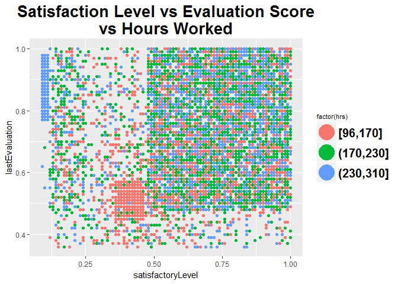<!-- -->

```r
p6 = ggplot(data = df, aes(satisfactoryLevel, lastEvaluation))
p6 + geom_point(aes(color = factor(promotionInLast5years))) + ggtitle("Satisfaction Level vs Evaluation Score\nvs Promotion") +
  theme(plot.title=element_text(size = 20, face = "bold", hjust = 0.5)) +
  theme(legend.title=element_text(size=8)) + theme(legend.text=element_text(size=10))+
  guides(colour = guide_legend(override.aes = list(size=9))) +
  theme(legend.text = element_text(size=15, face="bold"))
```

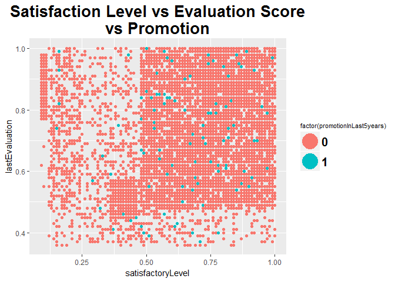<!-- -->

Now lets try some Classifier Techniques to predict whos going to leave
First, lets load the Test Data


```r
df2 <- read.csv("C:\\Users\\SGHOSH13\\Documents\\GyanData\\HR Analytics\\People Charm case_2.csv", stringsAsFactors = F)
dups <- which(duplicated(df2))
df2 <- df2[-dups, ]

df <- df[,-c(9,10,11)]
train <- df
test  <- df2[,-c(9,10)]
```

Decision trees


```r
model_dt <- rpart(left ~ ., data=train, method="class", minbucket=30)
fancyRpartPlot(model_dt, cex = 0.6)
```

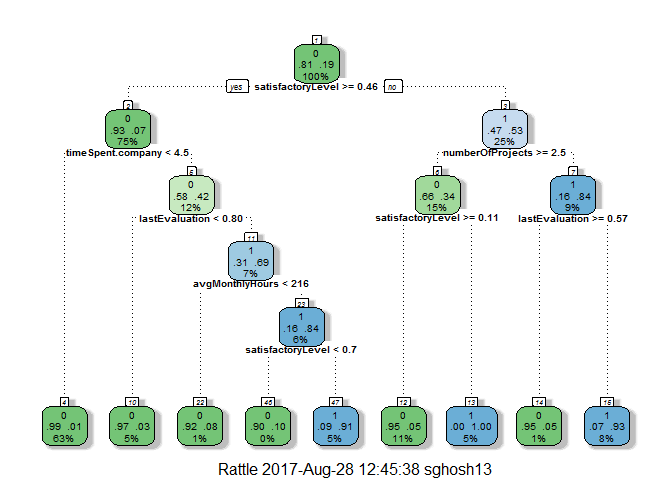<!-- -->

```r
predicted_dt <- predict(model_dt, test, type="class")
table(test$left, predicted_dt)
```

```
##    predicted_dt
##        0    1
##   0 3623   57
##   1   85  853
```

```r
mean(predicted_dt==test$left)
```

```
## [1] 0.9692508
```

```r
confusionMatrix(predicted_dt, df2$left)
```

```
## Confusion Matrix and Statistics
## 
##           Reference
## Prediction    0    1
##          0 3623   85
##          1   57  853
##                                          
##                Accuracy : 0.9693         
##                  95% CI : (0.9639, 0.974)
##     No Information Rate : 0.7969         
##     P-Value [Acc > NIR] : < 2e-16        
##                                          
##                   Kappa : 0.9039         
##  Mcnemar's Test P-Value : 0.02346        
##                                          
##             Sensitivity : 0.9845         
##             Specificity : 0.9094         
##          Pos Pred Value : 0.9771         
##          Neg Pred Value : 0.9374         
##              Prevalence : 0.7969         
##          Detection Rate : 0.7845         
##    Detection Prevalence : 0.8029         
##       Balanced Accuracy : 0.9469         
##                                          
##        'Positive' Class : 0              
## 
```

Random forests 


```r
model_rf <- randomForest(as.factor(left) ~ ., data=train, nsize=20, ntree=200)
predicted_rf <- predict(model_rf, test)
table(test$left, predicted_rf)
```

```
##    predicted_rf
##        0    1
##   0 3673    7
##   1   58  880
```

```r
mean(predicted_rf==test$left)
```

```
## [1] 0.9859246
```

```r
confusionMatrix(predicted_rf, df2$left)
```

```
## Confusion Matrix and Statistics
## 
##           Reference
## Prediction    0    1
##          0 3673   58
##          1    7  880
##                                           
##                Accuracy : 0.9859          
##                  95% CI : (0.9821, 0.9891)
##     No Information Rate : 0.7969          
##     P-Value [Acc > NIR] : < 2.2e-16       
##                                           
##                   Kappa : 0.9556          
##  Mcnemar's Test P-Value : 5.584e-10       
##                                           
##             Sensitivity : 0.9981          
##             Specificity : 0.9382          
##          Pos Pred Value : 0.9845          
##          Neg Pred Value : 0.9921          
##              Prevalence : 0.7969          
##          Detection Rate : 0.7954          
##    Detection Prevalence : 0.8079          
##       Balanced Accuracy : 0.9681          
##                                           
##        'Positive' Class : 0               
## 
```

Plotting ROC Curves for the Classifiers


```r
# Decision tree
predict_dt_ROC <- predict(model_dt, test)
pred_dt <- prediction(predict_dt_ROC[,2], test$left)
perf_dt <- performance(pred_dt, "tpr", "fpr")

auc_dt <- performance(pred_dt,"auc")
auc_dt <- round(as.numeric(auc_dt@y.values),3)

# Random forest
predict_rf_ROC <- predict(model_rf, test, type="prob")
pred_rf <- prediction(predict_rf_ROC[,2], test$left)
perf_rf <- performance(pred_rf, "tpr", "fpr")

auc_rf <- performance(pred_rf,"auc")
auc_rf <- round(as.numeric(auc_rf@y.values),3)

print(paste('AUC of Decision Tree:',auc_dt))
```

```
## [1] "AUC of Decision Tree: 0.968"
```

```r
print(paste('AUC of Random Forest:',auc_rf))
```

```
## [1] "AUC of Random Forest: 0.991"
```

```r
# Plotting the 2 curves 
plot(perf_dt, main = "ROC curves for all Classifiers", col='red', lwd=3)
plot(perf_rf, add=TRUE, col='blue', lwd=3)
legend('bottomright', c("Decision Tree", "Random Forest"), fill = c('red','blue'), bty='n', cex = 0.6)
abline(0,1, col = 'black', lwd =2)
```

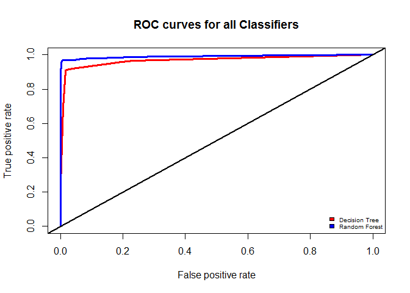<!-- -->
